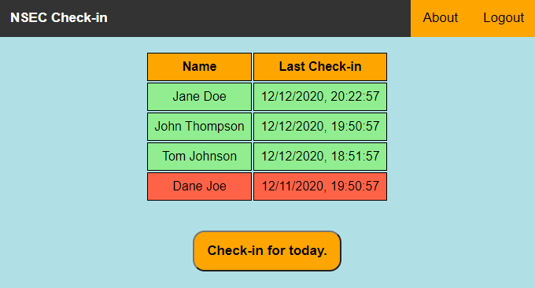
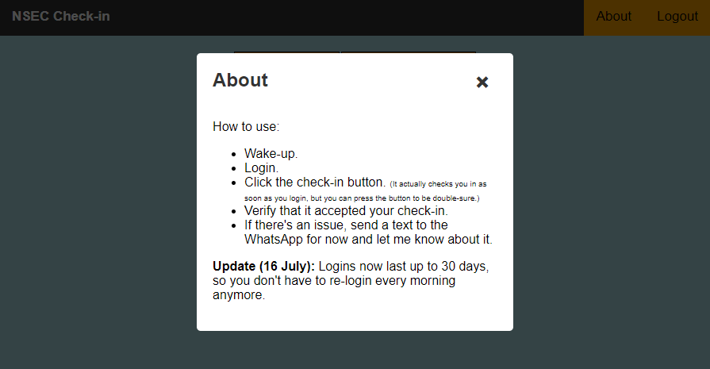

# Serverless Check-in App

A simple check-in app that allows users to check-in for accountability and see who else has checked in. It is built on a serverless framework using AWS Lambda, Cognito, S3, API Gateway, and DynamoDB.

